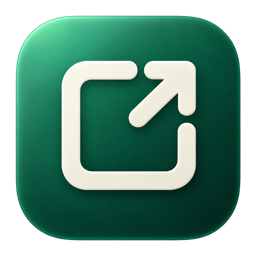

<p align="center">
  
</p>

<h1 align="center">Revvy</h1>

<p align="center">
  Capture, annotate, measure and share screenshots on the Mac — then turn them into GitHub issues.
</p>

<p align="center">
  <b>English</b> ·
  <a href="README.ja.md">日本語</a> ·
  <a href="README.zh-Hans.md">简体中文</a> ·
  <a href="README.ko.md">한국어</a>
</p>

<p align="center">
  <a href="LICENSE"></a>
  
  
</p>

---

Revvy is a native macOS app for showing — not just describing — what needs to change. Take a screenshot from anywhere, mark it up with boxes, arrows, text and pixel-accurate rulers, and share it as a GitHub issue or a link. Capturing, annotating, copying and saving work without any account.

> **Status:** early development (0.x). Expect rough edges and breaking changes.

## Table of contents

- [Features](#features)
- [Requirements](#requirements)
- [Installation](#installation)
- [Usage](#usage)
- [Keyboard shortcuts](#keyboard-shortcuts)
- [Settings](#settings)
- [Privacy](#privacy)
- [Building from source](#building-from-source)
- [Distributing a fork](#distributing-a-fork)
- [Localization](#localization)
- [Project structure](#project-structure)
- [Known limitations](#known-limitations)
- [Contributing](#contributing) · [Security](#security) · [License](#license)

## Features

**Capture from anywhere**
- Region and full-screen capture with ScreenCaptureKit
- Global shortcuts that work in any app (default <kbd>⌃⇧4</kbd> region, <kbd>⌃⇧3</kbd> full screen), customizable in Settings
- A small floating capture panel that stays on top of every app and can be collapsed to a single button
- Menu bar menu for capture, rulers and settings
- Multi-display aware: the selection overlay appears on every display, and the display you drag on is the one captured
- Import by drag and drop (Finder, browsers, Photos, the macOS screenshot thumbnail), from the clipboard, or from a file

**Annotate**
- Rectangle, arrow, pen and text tools in four colors
- Select, move and resize shapes; grab a shape directly while drawing (hold <kbd>⌥</kbd> to draw on top instead)
- Nudge by 1 px with the arrow keys (10 px with <kbd>⇧</kbd>), duplicate, delete, undo and redo
- Distance ruler in px, em or both, based on original image pixels
- Coordinate rulers and center guides that are never exported
- Zoom from 10% to 400%, pinch to zoom, hand tool for panning (100% shows one image pixel per screen point)

**On-screen ruler**
- Measure anything on screen without taking a screenshot — rulers float above every app
- Drag to move, drag edges to resize, arrow keys to nudge, <kbd>⌥</kbd>+arrows to resize
- Tick marks every 10 px, center guides, duplicate, multiple rulers at once
- Vertical and horizontal guide lines that span the whole display, with their position and the gap to the nearest parallel line
- Rulers and guide lines are included in screenshots, so you can share the measurement

**Keep and find**
- Capture history in the sidebar with notes
- On-device text recognition (Apple Vision) so you can search screenshots by the text inside them
- Copy the recognized text, copy the annotated image, or save it as PNG

**Share to GitHub**
- Sign in with GitHub's device flow (no client secret, token stored in the Keychain)
- Create an issue with the annotated screenshot, labels and assignees; environment details (app version, macOS, hardware, display) are added automatically
- Upload the annotated image and copy a link in one click
- Obvious secrets (tokens, JWTs, `Authorization`/`Cookie` headers, email addresses) are masked in issue text

## Requirements

- macOS 15 Sequoia or later
- Screen Recording permission (asked on first capture)
- A GitHub account only for the GitHub features

## Installation

### Download

Signed and notarized builds will be published on the [Releases](../../releases) page. Download the `.dmg`, drag **Revvy** to **Applications**, and open it.

### Build it yourself

See [Building from source](#building-from-source).

### First launch

1. Open Revvy. The floating capture panel appears near the top-right of the screen.
2. Take your first capture. macOS asks for **Screen Recording** permission — allow Revvy in **System Settings → Privacy & Security → Screen & System Audio Recording**.
3. If capturing still fails, quit and reopen Revvy (macOS sometimes applies the permission only after a restart).

## Usage

### Capturing

| How | What happens |
| --- | --- |
| <kbd>⌃⇧4</kbd> (global) or the region button in the floating panel | Drag to select an area. The overlay covers every display; press <kbd>Esc</kbd> to cancel. |
| <kbd>⌃⇧3</kbd> (global) or the display button | Captures the whole display under the pointer. |
| <kbd>⌘⇧V</kbd>, or **Capture ▾ → Paste from Clipboard** in the toolbar | Uses the image on the clipboard. |
| Drag and drop | Drop an image onto the Revvy window or the floating panel. |
| **Capture ▾ → Open Image File…** in the toolbar | Opens an image file. |

The Revvy window and the floating panel never show up in screenshots. On-screen rulers and guide lines do, so a capture keeps your measurement (their hover-only buttons are hidden). After a capture, all rulers and guide lines are removed from the screen; cancelling with <kbd>Esc</kbd> keeps them.

The floating panel's **×** collapses it to a single button; click that button to expand it again. To hide the panel completely, use the menu bar menu, Settings, or a shortcut.

### Annotating

Pick a tool from the palette at the bottom of the canvas:

- **Select and Move** — click a shape to select it, drag to move, drag an endpoint to adjust arrows and rulers.
- **Ruler** — drag to measure. Hold <kbd>⇧</kbd> for horizontal/vertical.
- **Rectangle**, **Arrow**, **Pen** — drag to draw. Dragging near an existing shape moves it; hold <kbd>⌥</kbd> to draw on top.
- **Text** — click to place text, type, press <kbd>↩</kbd> to confirm (<kbd>⌥↩</kbd> for a new line). Click placed text with the text tool, or double-click it with any tool, to edit.
- **Hand** — drag to pan when zoomed in.

Use the share menu in the toolbar to **Copy Image** or **Save as PNG…**. The annotated image is what gets copied, saved and shared. Guides, coordinate rulers and selection handles are never exported.

### On-screen ruler

Click the ruler button in the floating panel, choose **Add Screen Ruler** from the menu bar menu, or press <kbd>⌃⌘R</kbd>. A 320 × 200 ruler appears under the pointer.

- Drag inside to move; drag an edge or corner to resize.
- Arrow keys move it by 1 px (<kbd>⇧</kbd> for 10 px); <kbd>⌥</kbd>+arrows resize it.
- <kbd>⌘D</kbd> duplicates, <kbd>⌘;</kbd> toggles center guides, <kbd>Esc</kbd> or <kbd>⌘W</kbd> closes.
- Hover to reveal the guide, duplicate and close buttons; right-click for the same actions.
- <kbd>⌃⌘T</kbd> hides or shows all rulers and guide lines.

**Guide lines** — click the vertical or horizontal line button in the floating panel (or use the menu bar menu, or a ruler's right-click menu) to draw a line across the whole display at the pointer. Drag it, or use the arrow keys (<kbd>⇧</kbd> for 10 px), to move it. Its label shows the distance from the left or top edge of the display and, when there is another parallel line, the gap between them. <kbd>⌘D</kbd> duplicates, <kbd>Esc</kbd> or <kbd>⌫</kbd> removes. You can assign global shortcuts in Settings.

Sizes are in points, which match CSS pixels. The unit (px / em) follows the ruler setting.

### Sharing to GitHub

1. Click **Connect to GitHub** and approve the code in your browser (device flow).
2. Choose a repository in the inspector.
3. **Create and Copy Link** uploads the annotated image and copies its URL.
4. **Create Issue** creates an issue with the title (or the first line of the body), your comment, the screenshot, labels, assignees and environment details.

Images are committed to a dedicated branch (default `feedback-assets`) under `screenshots/`, not embedded in the issue body. In a public repository the images are public; in a private repository only people with access can see them. Deleting local history does not delete anything on GitHub.

Organization repositories may require the organization to approve the OAuth app.

## Keyboard shortcuts

| Shortcut | Action | Scope |
| --- | --- | --- |
| <kbd>⌃⇧4</kbd> | Capture area | Global (customizable) |
| <kbd>⌃⇧3</kbd> | Capture full screen | Global (customizable) |
| <kbd>⌃⌘R</kbd> | Add on-screen ruler | Global (customizable) |
| <kbd>⌃⌘T</kbd> | Show / hide rulers | Global (customizable) |
| — | Show / hide floating panel | Global (assign in Settings) |
| — | Add vertical / horizontal guide line | Global (assign in Settings) |
| <kbd>⌘⇧V</kbd> | Use clipboard image | App |
| <kbd>⌘Z</kbd> / <kbd>⇧⌘Z</kbd> | Undo / redo (text while typing, annotations otherwise) | App |
| <kbd>⌘D</kbd> | Duplicate selected annotation or ruler | App / ruler |
| <kbd>⌫</kbd> | Delete selected annotation | Canvas |
| Arrow keys | Nudge 1 px (<kbd>⇧</kbd> 10 px) | Canvas / ruler |
| <kbd>⌘+</kbd> <kbd>⌘-</kbd> <kbd>⌘1</kbd> <kbd>⌘0</kbd> | Zoom in, out, 100%, fit | Canvas |
| <kbd>⌘;</kbd> | Center guides | Canvas / ruler |
| <kbd>⌘↩</kbd> | Create issue | Inspector |

macOS reserves <kbd>⌘⇧3</kbd>, <kbd>⌘⇧4</kbd> and <kbd>⌘⇧5</kbd> for its own screenshots, so Revvy does not accept them as global shortcuts.

## Settings

Open **Revvy → Settings…** (<kbd>⌘,</kbd>) or **Settings…** in the menu bar menu.

- **Shortcuts** — record global shortcuts (click, then press keys; <kbd>Esc</kbd> cancels, <kbd>⌫</kbd> clears), show or hide the floating panel, reset to defaults. Revvy warns when another app already uses a combination.
- **Rulers** — unit (px, em, or both) and the root `font-size` used for em.
- **Issue** — label added automatically (default `app-feedback`) and the branch used for screenshots (default `feedback-assets`).
- **GitHub** — optional OAuth App Client ID override for forks.

## Privacy

- Captures, annotations, notes and recognized text are stored only on your Mac (`~/Library/Application Support/Revvy/Captures`).
- Text recognition runs on-device with Apple Vision.
- Your GitHub token is stored in the macOS Keychain.
- Revvy has no analytics, advertising or crash-reporting SDKs and sends nothing to its developers.
- Data leaves your Mac only when you use a GitHub feature, and only to the repository you chose.

Full details: [PRIVACY.md](PRIVACY.md)

## Building from source

Requirements: macOS 15+, Xcode 26+, and [XcodeGen](https://github.com/yonaskolb/XcodeGen).

```bash
brew install xcodegen
git clone https://github.com/<owner>/revvy.git
cd revvy
make run    # generate the Xcode project, build, and launch
```

Other targets:

```bash
make open   # generate and open Revvy.xcodeproj in Xcode
make build  # Debug build into build/
make test   # run the Swift Testing suite
make clean  # remove build output and the generated project
```

The Xcode project is generated from `project.yml` and is not committed.

### Code signing

By default the app is ad-hoc signed, so no Apple Developer account is needed. Because an ad-hoc signature changes on every build, macOS may ask for Screen Recording permission or Keychain access again. For everyday development, sign with your own certificate:

```bash
cp Config/Local.xcconfig.example Config/Local.xcconfig
# set DEVELOPMENT_TEAM to your team ID
make build
```

`Config/Local.xcconfig` is ignored by Git.

## Distributing a fork

1. **Bundle ID** — change `PRODUCT_BUNDLE_IDENTIFIER` in `project.yml` (the internal module is still named `IssueShot` for historical reasons).
2. **GitHub OAuth App** — create your own OAuth App at <https://github.com/settings/applications/new>, enable **Device Flow**, and put its Client ID in `IssueShot/OAuthConfig.swift`. Device flow does not use a client secret, so the Client ID can be public.
3. **Developer ID build** — with a Developer ID Application certificate and notary credentials:

   ```bash
   make notary-setup TEAM_ID=YOUR_TEAM_ID APPLE_ID=you@example.com
   make dist TEAM_ID=YOUR_TEAM_ID              # signs, notarizes, staples → dist/Revvy-<version>.dmg
   TEAM_ID=YOUR_TEAM_ID ./scripts/dist.sh --no-notarize   # sign and package only
   ```

   The DMG gets a branded install window (background art and icon layout). That needs `pip3 install --user dmgbuild pillow`; without them the script falls back to a plain disk image. Run `python3 scripts/make-dmg-background.py` to regenerate the artwork after changing the app icon.

4. **Mac App Store (optional)** — an `AppStore` build configuration with App Sandbox, a privacy manifest and export scripts is included. See [docs/APP_STORE.md](docs/APP_STORE.md).

## Localization

The app and this documentation are available in:

| Language | App | README |
| --- | --- | --- |
| Japanese (development language) | ✅ | [README.ja.md](README.ja.md) |
| English | ✅ | [README.md](README.md) |
| Simplified Chinese | ✅ | [README.zh-Hans.md](README.zh-Hans.md) |
| Korean | ✅ | [README.ko.md](README.ko.md) |

UI strings live in the String Catalog `IssueShot/Resources/Localizable.xcstrings`. To add or improve a language, open the catalog in Xcode, add translations, and send a pull request. Revvy follows the language order in **System Settings → General → Language & Region**; you can also set a per-app language there.

## Project structure

```
IssueShot/
  IssueShotApp.swift        App entry, menus, menu bar extra
  AppModel.swift            Capture, annotation, history and GitHub state
  CaptureControls.swift     Global shortcuts, floating panel, capture entry points
  Models/                   Annotations, geometry, viewport math, GitHub models
  Services/                 Screen capture, image drop, hotkeys, GitHub client/auth, OCR library, masking
  Views/                    SwiftUI/AppKit views: editor, sidebar, inspector, panel, on-screen ruler, settings
  Resources/                String Catalog, privacy manifest, icons
IssueShotTests/             Swift Testing suites
Config/                     Signing and build configuration
scripts/                    Distribution scripts
docs/                       Additional documentation
```

## Known limitations

- No video or GIF recording.
- Sharing uses a branch in your GitHub repository; there is no separate image host, so people without repository access cannot open links to private repositories.
- Screen Recording permission changes may require restarting the app.
- The GitHub OAuth App bundled with official builds is still registered under the name "IssueShot".

## Contributing

Bug reports, ideas and pull requests are welcome — see [CONTRIBUTING.md](CONTRIBUTING.md).

## Security

Please do not report vulnerabilities in public issues. See [SECURITY.md](SECURITY.md).

## License

[MIT](LICENSE) © Revvy contributors
